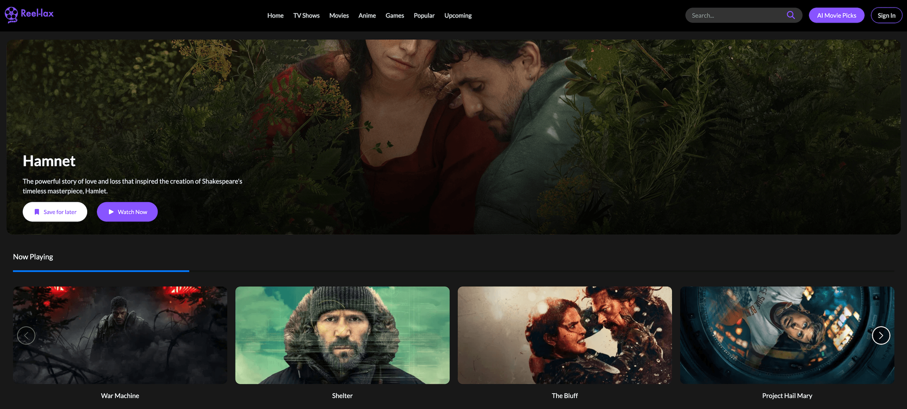

# 🎬 Reel-Lax | Movie & TV Show Explorer

  

<h3 align="center">Reel-Lax | Movie & TV Show Explorer</h3>

Reel-Lax is a user-friendly movie and TV show web application built with **React, Vite, and Tailwind CSS**. Explore content across categories like **Now Playing**, **Top Rated**, **Popular**, and **Upcoming**. The platform prioritizes **usability, responsiveness, and modern UI aesthetics**.  

---

## 🎥 Demo

  

---

## 📌 Problem

Users often want a visually engaging platform to explore movies and TV shows, but many existing apps have cluttered interfaces or poor mobile responsiveness. Additionally, browsing by category and seeing featured content isn’t always smooth or visually appealing.

---

## ✅ Solution

Reel-Lax provides:

- **Category browsing**: Quickly explore movies & shows by Now Playing, Top Rated, Popular, Upcoming  
- **Interactive content cards**: Key information like title, rating, and release date at a glance  
- **Responsive hero banner**: Eye-catching, horizontal banners for featured content  
- **Mobile-first design**: Fully responsive UI with smooth hover effects and visual feedback  
- **Clean navigation**: Quick access to Home, Movies, TV Shows, Anime, Games, Popular, and Upcoming sections  
- **Auth pages**: Styled Sign In & Sign Up forms  
- **AI Movie Picks button**: Placeholder for future AI recommendations  

> Note: The search bar is visually present but **not functional** in this version — focus was on UI/UX design and responsive layout.

---

## 🧑‍💻 Tech Stack

| Layer       | Technology                             |
| ----------- | -------------------------------------- |
| Frontend    | React, Vite                            |
| Styling     | Tailwind CSS, FontAwesome icons        |
| Routing     | React Router                           |
| Deployment  | Render                                 |

---

## 🔥 Key Features

- Responsive Hero Banner  
- Category Browsing (Now Playing, Top Rated, Popular, Upcoming)  
- Interactive Content Cards with Title, Rating, Release Date  
- Navigation Bar (Home, Movies, TV Shows, Anime, Games, Popular, Upcoming)  
- Sign In & Sign Up Pages  
- AI Movie Picks Button (Placeholder)  
- Mobile-First Design & Hover Effects  

---

## 🎯 Learning Outcomes

- Built a **modern, responsive SPA** with React + Vite  
- Applied **Tailwind CSS** for rapid, utility-first styling  
- Created **interactive content cards and hero banners**  
- Managed **routing with React Router**  
- Designed **mobile-first and accessible UI**  
- Learned how to **prepare a portfolio-ready frontend project** for deployment  

---

## 🚀 Live Demo

View Reel-Lax live: [https://reel-lax.onrender.com](https://reel-lax.onrender.com)